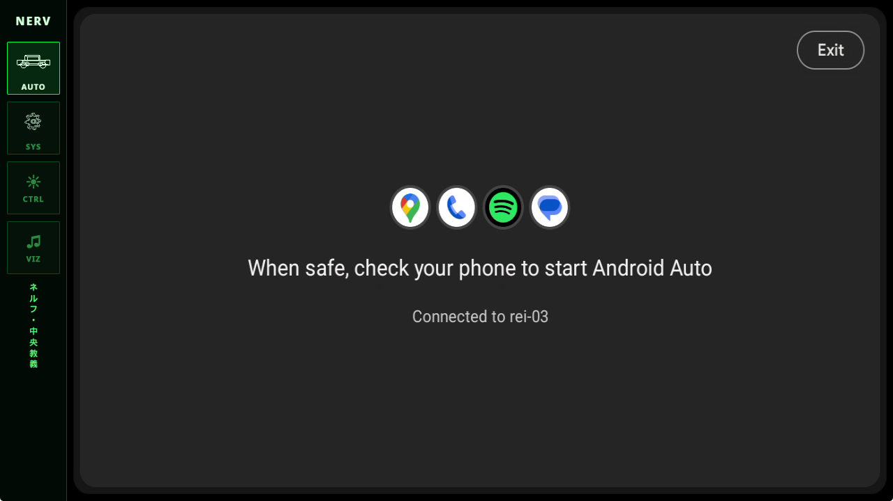
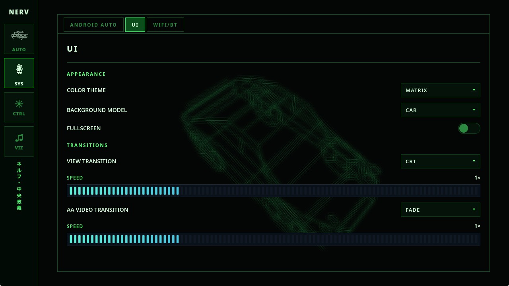
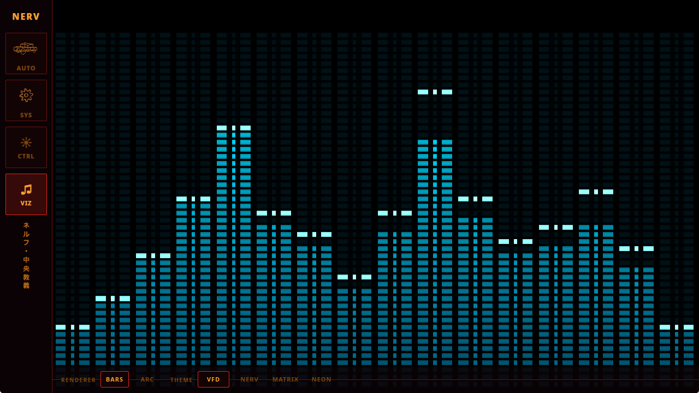

# Eva-navigation-unit

A DIY car head-unit interface for SBCs and Linux tablets. It aims to be a
fully-featured head-unit replacement for older cars that either never had one
or have a factory unit worth ripping out. The theme and aesthetic are inspired
by 90s cyberpunk anime and the Evangelion universe.


<details>
<summary>More screenshots</summary>

| | |
|---|---|
|  |  |
|  |  |

</details>


The current target hardware is a jailbroken Nintendo Switch OLED running
L4T Fedora, but the goal is to not gatekeep the project to a single hardware
configuration — hence the growing number of configuration options available
to tailor the experience to whatever screen/SBC you're running it on.

> [!WARNING]
> This project is mostly **vibe-coded** and is still in **early development
> and testing**. Expect rough edges, half-finished features, and breaking
> changes. It is not yet ready to be relied on as your car's only head unit.

## Features

- [x] Android Auto
  - [x] USB
  - [x] Wireless (WIP)
    - Automatically sets up the access point using the selected backend
      (`hostapd` or NetworkManager)
- [x] Live spectrum analyzer for audio visualization
  - Selectable analyzer theme and shape
- [ ] Bluetooth & media control
- [ ] Embeded media player
  - [ ] Spotify connect
  - [ ] Subsonic
  - [ ] mpc/local file
- [ ] Audio Equilizer & effects
- Nice 90s wireframe-style interface
  - [x] Multiple color themes
- [ ] OBD2
  - Display car telemetry in retro-style gauges and segment displays
  - Send back car telemetry to AA (rpm, speed, fuel tank...)
  - Show OBD2 engine faults
- [ ] Controller/GPIO input for integration with native car headunit buttons
- [ ] Multi-point touch input for AA

## Build Prerequisites (Fedora)

Install required system libraries:

```sh
sudo dnf install \
  gcc gcc-c++ make pkgconf-pkg-config perl \
  clang clang-devel \
  protobuf-compiler \
  fontconfig-devel \
  libxcb-devel libxkbcommon-devel libxkbcommon-x11-devel \
  wayland-devel mesa-libGL-devel mesa-libEGL-devel \
  openssl-devel \
  alsa-lib-devel \
  dbus-devel \
  nasm

# Runtime dependencies
sudo dnf install bluez NetworkManager pipewire-pulseaudio
```

| Group | Packages | Required by |
|-------|----------|-------------|
| Build tools | gcc, gcc-c++, make, pkgconf-pkg-config, perl | C/C++ compilation, pkg-config |
| Crypto | clang, clang-devel | aws-lc-rs bindgen |
| Protobuf | protobuf-compiler | android-auto build script |
| UI | fontconfig-devel, libxcb-devel, libxkbcommon-devel, libxkbcommon-x11-devel, wayland-devel, mesa-libGL-devel, mesa-libEGL-devel, openssl-devel | Slint (windowing, fonts, OpenGL) |
| Audio | alsa-lib-devel | cpal (ALSA) |
| D-Bus | dbus-devel | zbus, NetworkManager client |
| Video | nasm | OpenH264 asm optimizations |
| Runtime | bluez | Bluetooth (wireless transport) |
| Runtime | NetworkManager | Wi-Fi hotspot |
| Runtime | pipewire-pulseaudio (or pulseaudio) | Audio capture for the spectrum analyzer/visualizer |

## Build

```sh
cargo build --release
```

## Installing the Wi-Fi hotspot service (for Android Auto wireless)

> This step is only required when using the `hostapd` hotspot backend. If
> you're using the NetworkManager backend instead, you can skip it.

Android Auto wireless needs a privileged Wi-Fi access point. This is handled
by a small systemd service + polkit rule so the head-unit app itself never
needs to run as root:

```sh
cd deploy/eva-hotspot
sudo ./install.sh <username>             # one-time, needs root; <username> is
                                          # the account that runs eva-ui

# verify polkit works WITHOUT sudo:
systemctl start eva-hotspot.service && systemctl is-active eva-hotspot.service
systemctl stop  eva-hotspot.service
```

Then set `hotspot_backend = 1` (or the desired backend) in eva-ui's
`config.toml`. See [deploy/eva-hotspot/install.sh](deploy/eva-hotspot/install.sh)
and [deploy/eva-hotspot/hotspot.env](deploy/eva-hotspot/hotspot.env) for the
available options (SSID/PSK, channel, country code, DHCP range).

## Run

```sh
cargo build --release
DISPLAY=:0 ./target/release/eva-navigation-unit &> eva-ui.log   # NOTE: no sudo
```

## Configuration

`eva-navigation-unit` is configured via a TOML file, environment variables,
and CLI flags. See [docs/configuration.md](docs/configuration.md) for the
config file location, precedence rules, and the full list of options.

## Thanks

This project would not be possible without
[uglyoldbob/android-auto](https://github.com/uglyoldbob/android-auto), which
provides the Android Auto server implementation.