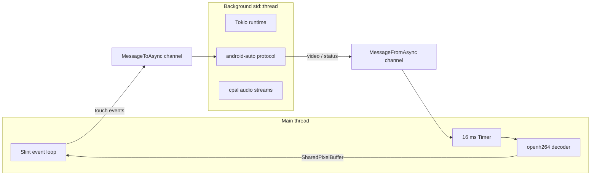

# Architecture

## Overview

`a310` is a thin GUI front end around the [`android-auto`](../../android-auto) library.
The library implements the full Android Auto wire protocol; `a310` provides the user
interface, audio I/O, and touch input plumbing required to drive it as a car head unit.

The application is split into three concerns:

1. **UI** — declarative Slint markup ([`ui/app.slint`](../ui/app.slint)) compiled to Rust at build time.
2. **Protocol runtime** — the `android-auto` event loop driven on a background thread.
3. **Bridge** — message channels and a UI-thread timer connecting the two.

## Threading model

Most windowing systems require the UI event loop to run on the main thread, while the
`android-auto` protocol is an async (Tokio) workload. These are kept on separate threads:

- **Main thread**: runs `AppWindow::run()` (the Slint event loop). A `slint::Timer`
  fires every 16 ms (~60 Hz), drains the inbound channel, decodes any video frames,
  and updates the `video-frame` image property.
- **Background thread**: owns a multi-threaded Tokio runtime that runs the
  `android-auto` protocol, the Bluetooth/Wi-Fi negotiation, and the `cpal` audio
  output/input streams.

Because the timer callback runs on the Slint main thread, decoded frames can be
assigned to the window property directly — no `invoke_from_event_loop` marshalling
is required.

## Message channels

Two Tokio `mpsc` channels bridge the threads:

| Channel | Direction | Payload |
|---------|-----------|---------|
| `MessageToAsync` | UI → protocol | `AndroidAutoMessage` (touch input as `InputEventIndication`) |
| `MessageFromAsync` | protocol → UI | `VideoData`, `Connected`, `Disconnected`, `ExitContainer` |

A third channel (`SendableAndroidAutoMessage`) is internal to the protocol handler and
relays sensor / audio-input messages produced asynchronously back into the link.

## Component map

| File | Responsibility |
|------|----------------|
| [`src/main.rs`](../src/main.rs) | App entry point, Slint wiring, all `android-auto` trait impls, audio setup, container lifecycle |
| [`src/nmrs_extensions.rs`](../src/nmrs_extensions.rs) | NetworkManager D-Bus hotspot creation for the wireless transport |
| [`ui/app.slint`](../ui/app.slint) | `AppWindow` component: sidebar navigation, AA video view, settings view |
| [`build.rs`](../build.rs) | Compiles `ui/app.slint` into generated Rust via `slint-build` |

### `AndroidAuto` handler

`AndroidAuto` is the central struct implementing every `android-auto` channel trait:

- `AndroidAutoMainTrait` — connect/disconnect lifecycle, transport capability flags
- `AndroidAutoVideoChannelTrait` — forwards H.264 frames to the UI channel
- `AndroidAutoAudioOutputTrait` — media / system / speech playback via `cpal`
- `AndroidAutoAudioInputTrait` — microphone capture (16 kHz mono)
- `AndroidAutoSensorTrait` — driving status & night mode
- `AndroidAutoInputChannelTrait` — touch/keycode binding config
- `AndroidAutoWirelessTrait` / `AndroidAutoBluetoothTrait` — wireless negotiation
- `AndroidAutoWiredTrait` — USB transport marker

`AndroidAutoContainer` wraps the background thread, owning its lifetime and the kill
channel. Dropping it tears down the protocol runtime cleanly.

## UI structure

`AppWindow` uses a `HorizontalLayout`:

- **Left sidebar** (90 px): two large (≥72 px) `TouchArea` nav buttons placed on the
  driver-near side, switching `active-view` between Android Auto (0) and Settings (1).
- **Content area** (stretches): conditionally renders the AA video `Image` (with a
  full-area `TouchArea` for input forwarding) or the settings placeholder.

Exposed UI interface (consumed by Rust):

| Item | Kind | Purpose |
|------|------|---------|
| `video-frame` | `in-out property <image>` | Current decoded video frame |
| `active-view` | `in-out property <int>` | Selected view (0 = AA, 1 = Settings) |
| `aa-connected` | `in-out property <bool>` | Toggles the "waiting" overlay |
| `touch-event(float,float,int)` | callback | Video touch → protocol (x, y, action) |
| `nav-to(int)` | callback | Sidebar navigation |

## Video pipeline

1. Phone streams H.264 over the AA video channel.
2. `receive_video` forwards raw bytes via `MessageFromAsync::VideoData`.
3. The UI timer splits NAL units with `openh264::nal_units` and decodes each.
4. Decoded YUV is converted to RGB8 and copied into a `slint::SharedPixelBuffer`.
5. The buffer becomes a `slint::Image` assigned to `video-frame`.

## Touch pipeline

1. `pointer-event` on the video `TouchArea` reports pointer position and kind.
2. Coordinates are scaled from logical UI pixels to video source pixels.
3. `touch-event` callback builds a `Wifi::TouchEvent` (down/move/up) and sends it
   through `MessageToAsync` to the phone.
