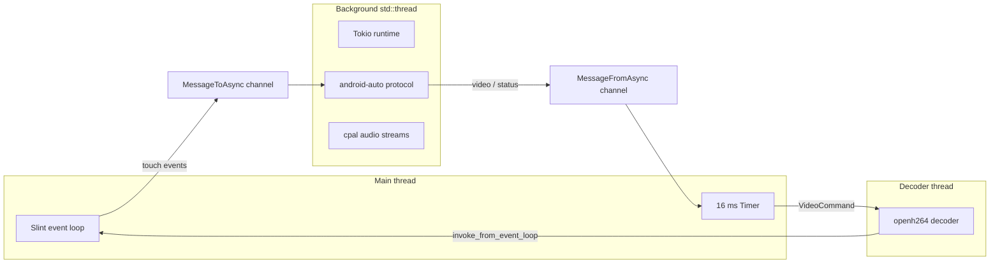

# Architecture

## Overview

`a310` is a thin GUI front end around the [`android-auto`](../../android-auto) library.
The library implements the full Android Auto wire protocol; `a310` provides the user
interface, audio I/O, and touch input plumbing required to drive it as a car head unit.

The application is split into three concerns:

1. **UI** — declarative Slint markup (see [UI structure](#ui-structure)) compiled to Rust at build time.
2. **Protocol runtime** — the `android-auto` event loop driven on a background thread.
3. **Bridge** — message channels, a dedicated decoder thread, and a UI-thread timer connecting the two.

## Threading model

Most windowing systems require the UI event loop to run on the main thread, while the
`android-auto` protocol is an async (Tokio) workload. Video decoding is CPU-heavy, so it
runs on its own thread to keep both the UI and the protocol responsive. Three threads are
involved:

- **Main thread**: runs `AppWindow::run()` (the Slint event loop). A `slint::Timer`
  fires every 16 ms (~60 Hz), drains the inbound channel, and forwards video data to
  the decoder thread and connection-state changes to the window properties.
- **Decoder thread**: owns the `openh264` decoder, receives `VideoCommand`s, decodes
  NAL units, converts YUV→RGB, and posts finished frames back to the UI via
  `slint::invoke_from_event_loop`.
- **Background thread**: owns a multi-threaded Tokio runtime that runs the
  `android-auto` protocol, the Bluetooth/Wi-Fi negotiation, and the `cpal` audio
  output/input streams.

Because `slint::Image` is not `Send`, the decoder hands the raw RGB bytes to the UI
thread and wraps them in an `Image` there (a cheap copy).

## Message channels

The message types live in [`src/messages.rs`](../src/messages.rs). Two Tokio `mpsc`
channels bridge the UI and the protocol thread, and a `std::sync::mpsc` channel feeds the
decoder thread:

| Channel | Direction | Payload |
|---------|-----------|---------|
| `MessageToAsync` | UI → protocol | `AndroidAutoMessage` (touch input as `InputEventIndication`) |
| `MessageFromAsync` | protocol → UI | `VideoData`, `Connected`, `Disconnected`, `ExitContainer` |
| `VideoCommand` | UI timer → decoder | `Frame(Vec<u8>)`, `Flush` |

A further channel (`SendableAndroidAutoMessage`) is internal to the protocol handler and
relays sensor / audio-input messages produced asynchronously back into the link.

## Component map

The Rust source is organized into focused modules so views, components, and features can
be added in isolation:

| File | Responsibility |
|------|----------------|
| [`src/main.rs`](../src/main.rs) | App entry point: init logging, build the window, call `ui::wire`, run the event loop |
| [`src/messages.rs`](../src/messages.rs) | Channel message enums (`MessageToAsync`, `MessageFromAsync`, `VideoCommand`) |
| [`src/ui.rs`](../src/ui.rs) | Wires window callbacks + the 16 ms polling timer; builds touch messages |
| [`src/video.rs`](../src/video.rs) | Dedicated H.264 decoder thread (`spawn_decoder`) |
| [`src/audio.rs`](../src/audio.rs) | `cpal` output/input stream builders |
| [`src/protocol.rs`](../src/protocol.rs) | `AndroidAuto` struct and all `android-auto` channel trait impls |
| [`src/container.rs`](../src/container.rs) | `AndroidAutoContainer`: background Tokio thread lifecycle + kill channel |
| [`src/nmrs_extensions.rs`](../src/nmrs_extensions.rs) | NetworkManager D-Bus hotspot creation for the wireless transport |
| [`ui/`](../ui) | Slint markup, split into `theme`, `components/`, `views/`, and the `app.slint` composition root |
| [`build.rs`](../build.rs) | Compiles `ui/app.slint` into generated Rust via `slint-build` |

### `AndroidAuto` handler

`AndroidAuto` is the central struct implementing every `android-auto` channel trait:

- `AndroidAutoMainTrait` — connect/disconnect lifecycle, transport capability flags
- `AndroidAutoVideoChannelTrait` — forwards H.264 frames to the UI channel
- `AndroidAutoAudioOutputTrait` — media / system / speech playback via `cpal`
- `AndroidAutoAudioInputTrait` — microphone capture (16 kHz mono)
- `AndroidAutoSensorTrait` — driving status & night mode
- `AndroidAutoInputChannelTrait` — touch/keycode binding config
- `AndroidAutoWirelessTrait` / `AndroidAutoBluetoothTrait` — wireless negotiation
- `AndroidAutoWiredTrait` — USB transport marker

`AndroidAutoContainer` (in [`src/container.rs`](../src/container.rs)) wraps the background
thread, owning its lifetime and the kill channel. Dropping it tears down the protocol
runtime cleanly.

## UI structure

The Slint markup is split so that styling, reusable widgets, and individual screens are
separate files. Imports are resolved relative to the importing file and followed
automatically by `build.rs`:

| File | Responsibility |
|------|----------------|
| [`ui/app.slint`](../ui/app.slint) | Composition root: `AppWindow`, sidebar + view slots, public API |
| [`ui/theme.slint`](../ui/theme.slint) | `Theme` global — color palette and animation durations |
| [`ui/components/sidebar.slint`](../ui/components/sidebar.slint) | Model-driven `Sidebar` + `NavItem` struct |
| [`ui/components/nav_button.slint`](../ui/components/nav_button.slint) | A single sidebar `NavButton` |
| [`ui/components/hud_panel.slint`](../ui/components/hud_panel.slint) | Bordered HUD `HudPanel` container |
| [`ui/components/view_slot.slint`](../ui/components/view_slot.slint) | `ViewSlot` — reusable slide+fade view wrapper |
| [`ui/views/android_auto.slint`](../ui/views/android_auto.slint) | `AndroidAutoView` — video image + waiting overlay |
| [`ui/views/settings.slint`](../ui/views/settings.slint) | `SettingsView` placeholder |

`AppWindow` uses a `HorizontalLayout`: a fixed `Sidebar` on the left and a clipped content
area on the right holding one `ViewSlot` per screen. The active view is selected by
`active-view`; inactive slots fade/slide out.

Exposed UI interface (consumed by Rust — unchanged across the modular refactor):

| Item | Kind | Purpose |
|------|------|---------|
| `video-frame` | `in-out property <image>` | Current decoded video frame |
| `active-view` | `in-out property <int>` | Selected view (0 = AA, 1 = Settings) |
| `aa-connected` | `in-out property <bool>` | Drives the video fade-in and "waiting" overlay |
| `touch-event(float,float,int)` | callback | Video touch → protocol (x, y, action) |
| `nav-to(int)` | callback | Sidebar navigation |

### Adding a view

1. Create `ui/views/<name>.slint` exporting a component.
2. Import it in `app.slint`, add a `NavItem` to the `Sidebar`'s `items`, and add a
   matching `ViewSlot` wrapping the new component.
3. Wire any new properties/callbacks in [`src/ui.rs`](../src/ui.rs).

## Theming and transitions

All colors and animation timings are centralized in [`ui/theme.slint`](../ui/theme.slint)
(`Theme` global), styled after a red-on-black "Central Dogma" aesthetic. Transitions:

- **View switching** — `ViewSlot` animates opacity and a horizontal slide when
  `active-view` changes.
- **Connect** — the video `Image` fades in from black when `aa-connected` becomes true
  (the previous frame is cleared on connect to avoid a flash of stale video).
- **Disconnect** — the "locked" overlay crossfades back over the last video frame, which
  is kept mounted until the next connect.

## Video pipeline

1. Phone streams H.264 over the AA video channel.
2. `receive_video` forwards raw bytes via `MessageFromAsync::VideoData`.
3. The UI timer forwards the bytes to the decoder thread as `VideoCommand::Frame`.
4. The decoder thread splits NAL units with `openh264::nal_units` and decodes each.
5. Decoded YUV is converted to RGB8; the raw bytes are sent to the UI thread via
   `slint::invoke_from_event_loop`, wrapped in a `slint::Image`, and assigned to
   `video-frame`.

On disconnect the timer sends `VideoCommand::Flush` to drain the decoder.

## Touch pipeline

1. `pointer-event` on the video `TouchArea` reports pointer position and kind.
2. Coordinates are scaled from logical UI pixels to video source pixels.
3. `touch-event` callback builds a `Wifi::TouchEvent` (down/move/up) and sends it
   through `MessageToAsync` to the phone.
