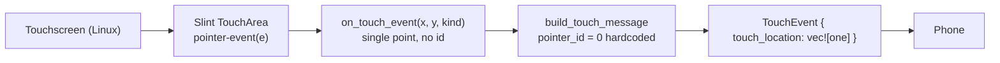

## How multi-touch would work

The short version: the **Android Auto protocol is already fully multi-touch capable**, but **Slint's `TouchArea` is the bottleneck** — it only ever reports a single logical pointer with no pointer ID. So adding real multi-touch means getting touch data from *somewhere other than Slint's `pointer-event` callback*.

Here's the picture today:

**Where it's stuck**

- ui/views/android_auto.slint — `pointer-event(e)` only exposes `e.kind` (down/up/move). Slint 1.x gives **no `pointer_id`** and fires the callback for a single tracked pointer.
- src/ui.rs — the `on_touch_event(|x, y, kind|)` callback carries one point.
- src/ui.rs — `build_touch_message` hardcodes `tl.set_pointer_id(0)` and sends exactly one `TouchLocation`.

**What's already ready**

- `TouchEvent` is `repeated TouchLocation` + `action_index` + `touch_action`, and the enum already has `POINTER_DOWN (5)` / `POINTER_UP (6)` (android-auto/protobuf/Wifi.proto). The generated Rust struct holds a `Vec<TouchLocation>`. So the wire format needs **no changes** — we just need to *feed it* multiple points.

### The Android Auto multi-touch contract

Each `InputEventIndication` you send should contain **all currently-down fingers** in `touch_location`, plus a `touch_action` and an `action_index` saying *which* finger triggered this event:

- First finger down → `POINTER_DOWN`, `action_index` = that finger
- Extra finger down → `POINTER_DOWN`, `action_index` = the new finger (and the list now includes all fingers)
- Any movement → `DRAG` (all fingers in the list)
- A finger lifts while others remain → `POINTER_UP`, `action_index` = the lifted finger
- Last finger lifts → `POINTER_UP` / `RELEASE`

### The realistic implementation path

Because Slint can't surface simultaneous pointers, the clean approach is to **read the touchscreen directly via Linux evdev/libinput** in a dedicated thread (the device speaks the MT-B protocol: `ABS_MT_SLOT`, `ABS_MT_TRACKING_ID`, `ABS_MT_POSITION_X/Y`, `BTN_TOUCH`), build a small slot→pointer-id state machine, map device coords → video pixel coords, and push complete multi-touch `TouchEvent`s straight to the worker channel — bypassing the Slint callback while the AA view is active. This is also why this is a non-trivial feature: it's a parallel input pipeline, not a tweak to the existing one.

## Plan: Android Auto Multi-Touch Support

The Android Auto wire protocol is **already multi-touch capable** — `TouchEvent.touch_location` is a `repeated` list with per-point `pointer_id`, plus `action_index` and `POINTER_DOWN`/`POINTER_UP` actions. The only blocker is **Slint**: its `TouchArea`/`pointer-event` reports a single logical pointer with no pointer ID (no multi-pointer API in Slint 1.x). So real multi-touch means sourcing touch data from **Linux evdev/libinput** directly, not from Slint's callback.

**Steps**

1. **Input source** — Add an `evdev` reader thread that opens the touchscreen device (configurable path or autodetect via `ABS_MT_POSITION_X` capability). Needs read access to `/dev/input/eventX`.
2. **MT state machine** *(depends on 1)* — Track `ABS_MT_SLOT` + `ABS_MT_TRACKING_ID`; map slot → stable small `pointer_id`. On `SYN_REPORT`, diff against the previous frame to classify: new track → `POINTER_DOWN`, removed → `POINTER_UP`, else → `DRAG`. Emit a `TouchEvent` containing **every still-down finger**.
3. **Coordinate mapping** *(parallel with 2)* — Map device coordinate ranges (from evdev absinfo) to video source pixels; AA view is fullscreen when active, so map device-range → `video-frame` dimensions.
4. **Worker wiring** *(depends on 2,3)* — Generalize `build_touch_message` to take a slice of points + `action_index`, or add a multi-touch message variant; reuse the existing `send_touch` mpsc channel. Gate emission to only fire while the AA view is connected/active, and disable the Slint `pointer-event` path to avoid double input.
5. **Fallback + config** — Keep the existing single-pointer Slint path for when raw input is unavailable; add a config.toml flag for device path / enable.

**Relevant files**

- src/ui.rs — `build_touch_message` (hardcodes `pointer_id(0)`, one location) and the `on_touch_event` callback at L283; generalize to multi-point.
- src/messages.rs — add multi-touch frame message if needed.
- src/main.rs — spawn the evdev reader thread, pass the channel handle.
- `eva-ui/src/touch.rs` (new) — evdev reader + MT state machine + coordinate mapping.
- ui/views/android_auto.slint — disable/keep the Slint touch path.
- config.toml + src/config.rs — device path / enable flag.
- Cargo.toml — add the `evdev`/`input` dependency.
- Reference only (no change): android-auto/protobuf/Wifi.proto.

**Verification**

1. `cargo build --release` succeeds.
2. With two fingers, logged `TouchEvent`s show two `TouchLocation`s with distinct `pointer_id`s and correct `POINTER_DOWN`/`POINTER_UP` + `action_index` sequencing.
3. On a connected phone, **pinch-to-zoom in Maps** works (canonical multi-touch test); single tap/drag still works.
4. Touch a known phone UI element and confirm the hit lands accurately (coordinate mapping).
5. With raw input disabled, single-touch still forwards via the Slint fallback; one tap = exactly one `POINTER_DOWN`/`UP` (no double input).

**Decisions**

- Real multi-touch requires bypassing Slint; the wire protocol needs **no changes** — only the sender feeds multiple points.
- Out of scope: forking Slint, in-app gesture recognition (the phone handles gestures), and the android-auto receive-side input handler.

**Further Considerations**

1. **Input path** — Option A (recommended): evdev/libinput raw reader for true multitouch. Option B: stay in Slint — *not viable* for real multitouch in 1.x (single pointer only).
2. **Device discovery** — autodetect the touchscreen vs. a configured input path in config.toml? Recommend autodetect with config override.
3. **Backend conflict** — if you run Slint's `linuxkms`/libinput backend, the raw reader and Slint may both want the device; need to confirm they don't grab it exclusively. Which Slint backend does the head unit use (winit/X11/Wayland vs. linuxkms)?

Want me to refine any part — e.g., lock in the evdev approach, or detail the MT state machine and the message-type changes further?